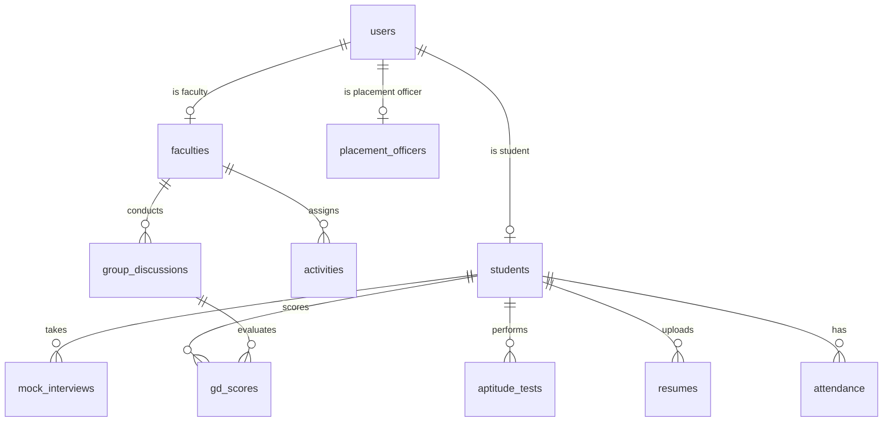

# Database Schema and Design

This document details the PostgreSQL relational design for the **Smart Soft Skills Management System for Placement Readiness**.

## Overview of Relationships

---

## Tables Specification

### 1. Users
Stores credentials, role levels, and basic profile info for all platform actors.
*   `user_id` (UUID, PK) - Unique user identifier.
*   `name` (VARCHAR(100), NOT NULL) - Full name.
*   `email` (VARCHAR(255), UNIQUE, NOT NULL) - Email address.
*   `password_hash` (VARCHAR(255), NOT NULL) - bcrypt hashed password.
*   `role` (VARCHAR(30), NOT NULL) - One of: `'STUDENT'`, `'FACULTY'`, `'PLACEMENT_OFFICER'`, `'ADMIN'`.
*   `department` (VARCHAR(100), NOT NULL) - College department (e.g. `'CSE'`, `'ECE'`).
*   `created_at` (TIMESTAMP WITH TIME ZONE, DEFAULT NOW()).

### 2. Students
Maintains profile scores and placement metrics.
*   `student_id` (UUID, PK -> FK references `users.user_id` ON DELETE CASCADE).
*   `roll_no` (VARCHAR(50), UNIQUE, NOT NULL) - University Roll Number.
*   `year` (INT, NOT NULL) - Current year of study (1-4).
*   `cgpa` (NUMERIC(4,2), NOT NULL) - Grade point average.
*   `placement_score` (INT, DEFAULT 0) - Calculated readiness index based on mock interviews, GDs, and aptitude tests.

### 3. Faculties
Specialization mapping for faculty evaluators.
*   `faculty_id` (UUID, PK -> FK references `users.user_id` ON DELETE CASCADE).
*   `specialization` (VARCHAR(150)) - Focus domain (e.g. `'Aptitude'`, `'Communication'`).

### 4. Activities
Assigned tasks and modules.
*   `activity_id` (UUID, PK).
*   `title` (VARCHAR(200), NOT NULL).
*   `description` (TEXT).
*   `due_date` (TIMESTAMP WITH TIME ZONE, NOT NULL).
*   `assigned_by` (UUID, FK -> references `faculties.faculty_id` ON DELETE SET NULL).
*   `category` (VARCHAR(50), NOT NULL) - E.g. `'COMMUNICATION'`, `'MOCK_INTERVIEW'`, `'GD'`, `'APTITUDE'`.

### 5. Mock Interviews
Virtual and physical mock interview records with AI + Faculty feedback.
*   `interview_id` (UUID, PK).
*   `student_id` (UUID, FK -> references `students.student_id` ON DELETE CASCADE).
*   `score` (INT) - Grade (0-100).
*   `feedback` (TEXT) - Detailed faculty comments.
*   `ai_feedback` (JSONB) - Speech analysis, grammar score, tone analysis, resume alignment.
*   `recording_url` (VARCHAR(512)) - Video upload path on Cloudinary.
*   `status` (VARCHAR(30), DEFAULT `'PENDING'`) - `'PENDING'`, `'COMPLETED'`.
*   `date` (TIMESTAMP WITH TIME ZONE, DEFAULT NOW()).

### 6. Group Discussions
Tracks group evaluations.
*   `gd_id` (UUID, PK).
*   `topic` (VARCHAR(255), NOT NULL) - Topic of discussion.
*   `faculty_id` (UUID, FK -> references `faculties.faculty_id` ON DELETE SET NULL).
*   `date` (TIMESTAMP WITH TIME ZONE, DEFAULT NOW()).

### 7. GD Scores
Student performance metrics in group discussions.
*   `score_id` (UUID, PK).
*   `student_id` (UUID, FK -> references `students.student_id` ON DELETE CASCADE).
*   `gd_id` (UUID, FK -> references `group_discussions.gd_id` ON DELETE CASCADE).
*   `score` (INT) - Grade (0-100).
*   `feedback` (TEXT) - Evaluator comments.

### 8. Aptitude Tests
Quantitative and logical assessments.
*   `test_id` (UUID, PK).
*   `student_id` (UUID, FK -> references `students.student_id` ON DELETE CASCADE).
*   `score` (INT) - Correct answers.
*   `total_questions` (INT) - Total query list.
*   `category` (VARCHAR(100)) - E.g., `'Logical'`, `'Quantitative'`, `'Verbal'`.
*   `date` (TIMESTAMP WITH TIME ZONE, DEFAULT NOW()).

### 9. Resumes
ATS verification details and feedback.
*   `resume_id` (UUID, PK).
*   `student_id` (UUID, FK -> references `students.student_id` ON DELETE CASCADE).
*   `file_url` (VARCHAR(512), NOT NULL) - Resume document path on Cloudinary.
*   `ats_score` (INT) - Parser rating (0-100).
*   `ai_suggestions` (JSONB) - Keyword alignments, structure recommendations.
*   `created_at` (TIMESTAMP WITH TIME ZONE, DEFAULT NOW()).

### 10. Attendance
Session participation log.
*   `attendance_id` (UUID, PK).
*   `student_id` (UUID, FK -> references `students.student_id` ON DELETE CASCADE).
*   `date` (DATE, NOT NULL).
*   `status` (VARCHAR(20), NOT NULL) - `'PRESENT'`, `'ABSENT'`.

### 11. Notifications
System alert router.
*   `notification_id` (UUID, PK).
*   `user_id` (UUID, FK -> references `users.user_id` ON DELETE CASCADE).
*   `message` (TEXT, NOT NULL).
*   `is_read` (BOOLEAN, DEFAULT FALSE).
*   `created_at` (TIMESTAMP WITH TIME ZONE, DEFAULT NOW()).

---

## DB Performance & Indexes
- Index on `users.email` for quick authentication lookups.
- Composite index on `gd_scores(student_id, gd_id)` for analytics query resolution.
- Index on `students.placement_score` to optimize student leaderboards.
